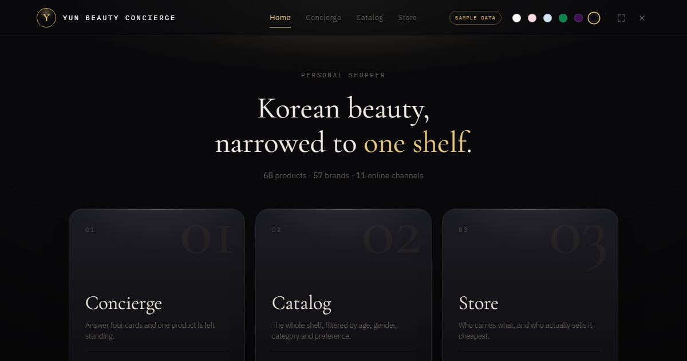

# Yun Beauty Concierge

카드 네 장에 답하면 한국 화장품 하나가 남습니다.
그 제품의 가격대와, 온라인 11개 채널 중 어디가 가장 싼지를 함께 보여줍니다.

**[→ 사이트 열기](https://yun-concierge.vercel.app)**



---

## 데이터에 대하여 — 먼저 밝힙니다

**지금 화면의 가격은 표본입니다.** 실제로 수집한 숫자가 아닙니다.

제품명과 브랜드는 실재하는 한국 화장품이고 가격대도 실제 시세를 본떴지만,
`index.html` 안에 68개가 상수로 박혀 있습니다. 어느 쇼핑몰에서도 긁어오지 않았습니다.

이 사실을 숨기지 않습니다. 헤더에 `SAMPLE DATA` 배지가 항상 떠 있고, 가격이 나오는
모든 화면에 경고 문구가 붙습니다.

> **Sample ranges — this build ships without live pricing.**
> The ordering and bands illustrate the layout; they are not any store's real price.

수집기는 실제로 동작하는 코드입니다. `scraper/` 에 있고, 화면이 읽는 것과 **동일한
스키마**를 내보냅니다. 다만 이 빌드에는 연결하지 않았습니다. 네이버 쇼핑 공식 API로
실제 가격을 채우는 방법은 [scraper/LIVE_PRICES.md](scraper/LIVE_PRICES.md) 에 적어두었습니다.
데이터를 연결하면 배지가 `NAVER SHOPPING API` 로 바뀌고 같은 화면이 진짜 숫자를 그립니다.

---

## 화면 셋

| | |
|---|---|
| **Concierge** | 나이·피부 고민·용도·취향 네 가지를 고르면 한 제품으로 좁혀집니다 |
| **Catalog** | 68개 전체를 나이·성별·카테고리·취향으로 거르고 정렬합니다 |
| **Store** | 어느 채널이 무엇을 취급하고, 실제로 어디가 싸게 파는지 |

## 왜 정확한 금액 대신 '가격대'인가

이 프로젝트에서 가장 신경 쓴 설계 판단입니다.

매장별 정확 금액은 **시간이 지나면 반드시 틀리는 주장**입니다. 쇼핑몰은 매일 가격을
바꾸고 각자 프로모션을 돌립니다. 그래서 화면은 `₩53,000–55,000` 같은 **범위**와
`baseline / +2% / +4%` 같은 **상대 위치**만 싣습니다. 둘 다 하루이틀 지나도 대체로
유효합니다. 확인이 필요한 사용자는 매장 링크를 눌러 직접 봅니다.

값은 ₩500 단위로 반올림합니다 — 어림값이라는 걸 눈으로도 알 수 있게.

---

## 수집기 (`scraper/`)

```
채널 어댑터 → 정규화 → 동일 상품 매칭 → 속성 태깅 → catalog.json
```

가격 수집은 조심해서 다뤄야 하는 작업이라, 지키는 선을 코드에 명시해 두었습니다.

- **robots.txt 우선** — 채널마다 `RobotFileParser` 로 해당 경로가 허용되는지 먼저 확인하고,
  막혀 있으면 그 채널을 건너뜁니다
- **공개 API 우선** — 네이버처럼 공식 검색 API가 있으면 HTML을 긁지 않고 API를 씁니다
- **낮은 요청률** — 채널당 동시 2건, 요청 간 1.2초. 429/503은 지수 백오프
- **공개 정보만** — 로그인·개인화 페이지, 회원 전용가는 대상이 아닙니다
- **캐시** — 개발 중 같은 페이지를 반복 요청하지 않도록 응답을 `.cache/` 에 보관

리뷰 집계는 **본문을 저장하지 않습니다.** 대가성·중복을 걸러낸 뒤 19종의 주제
(수분 지속, 백탁 없음 등)로 집계한 결과만 남깁니다.

어댑터는 채널 유형별로 세 가지입니다 — JSON-LD 파싱형, 내부 JSON API형, 공개 API형.
자세한 구조는 [scraper/README.md](scraper/README.md) 에 있습니다.

---

## 기술 선택

**프레임워크 없음. 빌드 도구 없음. 의존성 없음.** 사이트 전체가 HTML 파일 하나입니다.

React도 번들러도 쓰지 않았습니다. 화면 세 개와 필터 한 벌에 그만한 도구가 필요하지
않았고, 파일 하나면 어디에나 올라갑니다. 배포본 114KB, 페이지가 불러오는 외부 리소스는 웹폰트뿐입니다.

`build.py` 는 이 프로젝트의 유일한 빌드 단계입니다. 원본 `index.html` 은 doctype과
`<head>` 가 없는 **조각**이라, 이 스크립트가 charset·viewport·링크 미리보기 메타를
씌워 `dist/index.html` 을 만듭니다.

색상 테마 6종은 `localStorage` 에 남고, 화면 전환에는 View Transitions API를 씁니다.
`prefers-reduced-motion` 을 존중합니다.

---

## 로컬에서 실행

```bash
python build.py
python -m http.server 8000 --directory dist
#   → http://localhost:8000
```

맨 바깥 `index.html` 을 브라우저로 직접 열면 한글이 깨집니다. 위에서 말한 조각 파일이라
그렇습니다. 반드시 `dist` 를 띄워서 보세요.

## 구조

```
index.html     사이트 원본 — 이것을 고칩니다
build.py       원본 → 배포본
dist/          배포되는 결과물 (index.html + og.png)
scraper/       가격·리뷰 수집 파이프라인 (배포 대상 아님)
```

## 문서

- [DEPLOY.md](DEPLOY.md) — 배포 방법과 주의점
- [SETUP.md](SETUP.md) — 이 프로젝트를 다른 계정으로 옮기기
- [scraper/README.md](scraper/README.md) — 수집기 구조와 원칙
- [scraper/LIVE_PRICES.md](scraper/LIVE_PRICES.md) — 실제 가격 연결하기
- [scraper/REVIEWS.md](scraper/REVIEWS.md) — 리뷰 집계 방식
